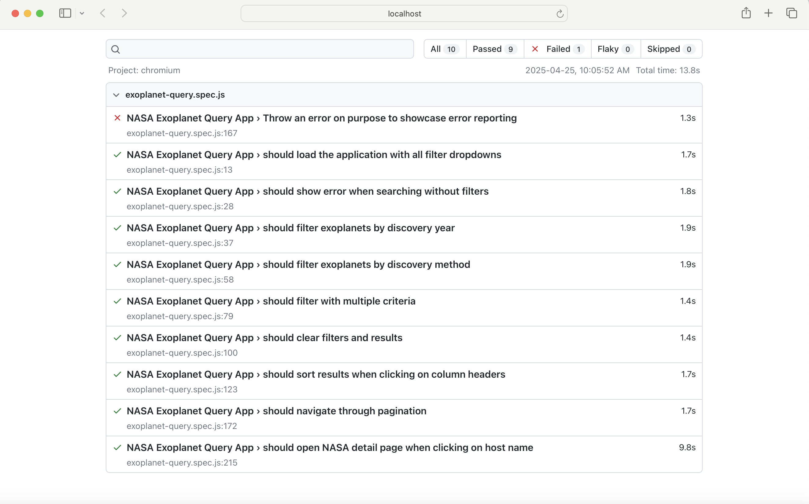

# NASA Exoplanet Query Application

This application allows users to search through NASA's exoplanet data using various filters including discovery year, method, host name, and discovery facility.

## Table of Contents
- [Features](#features)
- [Workflow and Demo](#workflow-and-demo)
- [Tech Stack](#tech-stack)
- [Setup Instructions](#setup-instructions)
- [Running the Application](#running-the-application)
- [Testing](#testing)
- [Design Decisions & Assumptions](#design-decisions--assumptions)
- [Future Improvements](#future-improvements)

## Features

- 🔍 Filter exoplanets by year of discovery, discovery method, host name, and discovery facility
- 📊 Display results in a sortable table format
- 📑 Pagination support for large result sets
- 🔗 Host names link to NASA's Confirmed Planet Overview Page
- 🔄 Sort functionality for all columns
- ✅ Comprehensive automated testing with Playwright

## Workflow and Demo

https://github.com/user-attachments/assets/d9c9ffb1-308a-4e47-9558-5235f13639ee

- User can query NASA's exoplanet archive on year of discovery, discovery method, host name, and discovery facility using the dropdown filters, `Clear` and `Search` buttons
- If the `Search` button was clicked but no query values were selected, an error message is presented
- If a valid search was performed, user can see the matching exoplanet data displayed in tabular format in the query panel
- User can click on the hostname which is a hyperlink to NASA's Confirmed Planet Overview Page for the selected planet in a new browser tab
- Sorting functionality in ascending and descending order is available via the results panel
- Pagination functionality is available via MUI's component and backend filtering

## Tech Stack

### Backend
- Node.js
- Express
- Axios for API requests
- CSV parser

### Frontend
- React with components and custom hooks for modularity and extensiblity with separation of layout and services
- CSS

### Testing
- Playwright for end-to-end testing

## Setup Instructions

### Prerequisites
- Node.js (v14 or later)
- npm (v6 or later)

### Backend Setup
1. Clone the repository:
   ```
   git clone git@github.com:cynthiachiu/nasa-exoplanets.git
   cd nasa-exoplanets
   ```

2. Install backend dependencies:
   ```
   cd server
   npm install
   ```

### Frontend Setup
1. Install frontend dependencies:
   ```
   cd ../client
   npm install
   ```

2. Install Playwright for testing:
   ```
   npm install --save-dev @playwright/test
   npx playwright install
   ```

## Running the Application

### Starting the Backend Server
```
cd server
node server.js
```
The server will start on http://localhost:5000

### Starting the Frontend Application
```
cd client
npm start
```
The application will be available at http://localhost:3000

## Testing

### Running End-to-End Tests
Make sure the backend server is running, then:

```
cd client
npm run test:e2e
```

This will run the Playwright tests and generate an HTML report with the results.

### Viewing Test Reports
After running tests, you can view the HTML report which includes screenshots of the failed test when you click into it:

```
npx playwright show-report
```

## Design Decisions & Assumptions

### Data Loading & Storage
- I chose to load all exoplanet data on server startup rather than querying NASA's API for each user request. This design decision improves response time for subsequent user queries.
- The data is stored in memory for fast access for the POC. Future improvements can store the data in a database instead of loading into memory.

### Filter Implementation
- Dropdowns are populated with unique values from the dataset to ensure users only select valid options.
- The filtering logic combines multiple criteria with an AND relationship, assuming users want to narrow down results rather than expand them.

### Pagination
- A limit of 10 items per page was implemented to prevent overwhelming users with too much data at once.
- The pagination control adapts to show a reasonable number of page links with ellipses for large result sets.

### Sorting
- Column sorting is handled server-side to minimize data transfer and leverage server processing power.
- Both ascending and descending sorting is supported on all columns.

### API Structure
- RESTful principles were followed for clarity and maintainability.
- Separate endpoints were created for filter options and exoplanet data to allow the frontend to load the UI before data is available.

### Testing Approach
- End-to-end tests with Playwright were used to verify the entire application flow.
- Tests are designed to be resilient to small UI changes by focusing on functionality.

## Future Improvements

1. **Caching Layer**: Implement Redis or similar caching for frequently accessed queries
2. **Server-Side Rendering**: Convert to Next.js for improved SEO and initial load performance

This project could be migrated to Next.js, a React framework that supports server-side rendering (SSR) out of the box. By handling filtering, sorting, and pagination on the server, we reduce the client-side workload and speed up initial page loads — especially important when working with large datasets like NASA's exoplanet records.

Benefits of using Next.js with SSR:

⚡ Faster initial page loads by pre-rendering filtered result pages on the server.

🧠 Better SEO for public searchability of queryable results (e.g. /exoplanets?method=Transit).

🧹 Cleaner code split between client logic (UI interactions) and server logic (data fetching).

🔁 We can eliminate the separate calls to our backend by fetching data directly during the rendering process.

This transition would involve replacing the Express server with Next.js API routes and refactoring React components to leverage getServerSideProps() for dynamic data fetching wherein:
- `getServerSideProps` gets called on initial page load and navigation to that page with new query parameters
- It passes the returned data as props to the `Exoplanets` component
- Renders the full HTML page on the server and sends that fully rendered HTML to the browser

```
import { useRouter } from 'next/router';
import Link from 'next/link';

export async function getServerSideProps(context) {
  const { year = '', method = '', page = 1 } = context.query;

  const query = new URLSearchParams({ year, method, page }).toString();
  const res = await fetch(`http://localhost:3000/api/exoplanets?${query}`);
  const data = await res.json();

  return {
    props: {
      exoplanets: data.data,
      totalPages: data.totalPages,
      currentPage: data.page,
      filters: { year, method },
    },
  };
}

export default function Exoplanets({ exoplanets, totalPages, currentPage, filters }) {
  const router = useRouter();

  const handleFilter = (e) => {
    e.preventDefault();
    const year = e.target.year.value;
    const method = e.target.method.value;
    router.push(`/exoplanets?year=${year}&method=${method}`);
  };

  return (
    <div>
      <h1>Exoplanet Explorer</h1>

      <form onSubmit={handleFilter}>
        <input name="year" placeholder="Year" defaultValue={filters.year} />
        <input name="method" placeholder="Method" defaultValue={filters.method} />
        <button type="submit">Search</button>
      </form>

      <ul>
        {exoplanets.map((planet, idx) => (
          <li key={idx}>{planet.hostname} - {planet.disc_year}</li>
        ))}
      </ul>

      <div>
        {Array.from({ length: totalPages }, (_, i) => (
          <Link
            key={i}
            href={{
              pathname: '/exoplanets',
              query: { ...filters, page: i + 1 }
            }}
          >
            <a style={{ marginRight: 10, fontWeight: i + 1 === currentPage ? 'bold' : 'normal' }}>
              {i + 1}
            </a>
          </Link>
        ))}
      </div>
    </div>
  );
}
```
